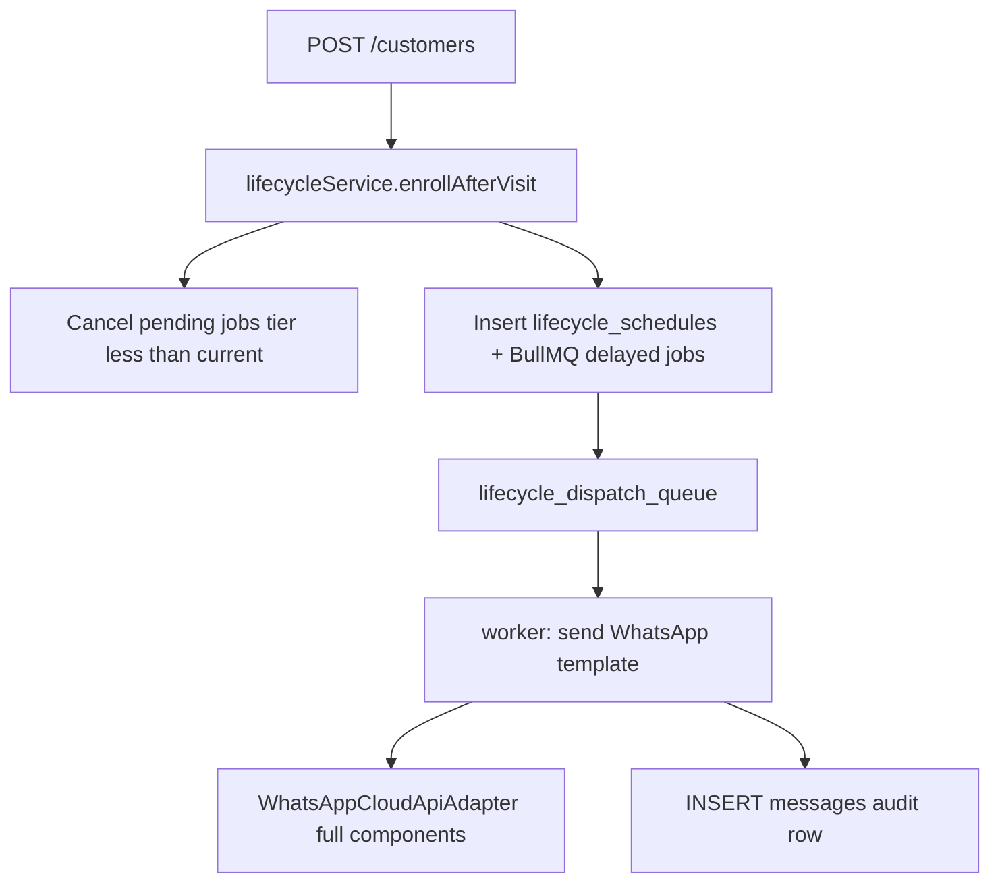

# Lifecycle WhatsApp Journeys & Profile UX

## Scope summary

| Area | Work |
|------|------|
| Profile | Remove logo URL field; show **Status** and **Categories** as highlighted form-style fields |
| Templates | Delete/archive existing templates; seed **16 lifecycle templates** (4 visit groups × Day 0/3/7/14) |
| Automation | On visit: schedule WhatsApp sends; tier advances on 2nd/3rd/4th visit; cancel prior-tier pending sends |
| Meta format | Extend adapter to send header (text/image), body variables, button URL params |
| UI | Merchant templates page grouped by visit tier |

---

## Assumptions (confirm or adjust before build)

You skipped the architecture questionnaire. Defaults below match your description:

1. **Day 0** — send **5 minutes** after the qualifying visit is recorded (`POST /customers`).
2. **Day 3 / 7 / 14** — send on **calendar offset from that visit**: `visit_at + 3d`, `+7d`, `+14d` (not rolling “inactive until today” polling). If the customer returns before a milestone fires, that pending job is **cancelled** when they re-enter the journey at a new tier.
3. **Tier rule** — after visit N, customer is in visit group N (capped at **Fourth Visit** for visit 4+). **All unsent** messages from lower tiers are cancelled immediately.
4. **Template ownership** — **platform-global** templates seeded once; merchants get forked copies via existing [`template-service.ts`](apps/api/src/lib/template-service.ts) (read-only lifecycle structure, editable copy text if needed later).
5. **Header image** — per-template `header_image_url` field (Meta image header parameter at send time).
6. **WhatsApp opt-in** — only schedule if `customers.whatsapp_opt_in = TRUE`.

---

## Architecture



**Why not cron-only?** BullMQ delayed jobs give precise Day 0 (+5 min) and scale to millions of schedules with Redis; a lightweight **reconciler** (hourly) catches missed jobs after worker restarts.

**Why not campaigns table?** Lifecycle sends are 1:1, event-driven, and tier-scoped — a dedicated `lifecycle_schedules` table avoids overloading campaign audience logic and makes cancellation/idempotency trivial.

---

## 1. Profile UI (small)

File: [`apps/web-merchant/app/profile/ProfilePageClient.tsx`](apps/web-merchant/app/profile/ProfilePageClient.tsx)

- Remove logo URL input, preview image, and `shopLogo` from PATCH payload/state.
- Replace muted `merchant-profile-meta` paragraphs with labeled read-only fields in the form grid:
  - **Status** — badge/chip styling (e.g. `.merchant-profile-badge`)
  - **Categories** — chip list from `itemCategories` (or “—” if empty)
  - Keep subscription/plan as secondary badges in same row

CSS in [`apps/web-merchant/app/globals.css`](apps/web-merchant/app/globals.css): `.merchant-profile-badge`, `.merchant-profile-chips`.

---

## 2. Template model & seed (replace all)

### Migration `infra/db/migrations/0010_lifecycle_templates.sql`

**Extend `templates`:**
- `visit_group` — `first_visit | second_visit | third_visit | fourth_visit` (nullable for non-lifecycle)
- `lifecycle_day` — `day_0 | day_3 | day_7 | day_14` (nullable)
- `header_image_url` — TEXT (nullable, for Meta IMAGE header)
- Unique partial index: `(merchant_id, visit_group, lifecycle_day) WHERE archived_at IS NULL AND visit_group IS NOT NULL`

**Data reset (dev + seed):**
- `UPDATE templates SET archived_at = NOW()` (soft-delete all current templates)
- Seed **16 global** templates via updated [`scripts/seed-demo.mjs`](scripts/seed-demo.mjs) or new `scripts/seed-lifecycle-templates.mjs`

Naming convention (Meta `name` must match approved template):

| visit_group | lifecycle_day | Example `name` |
|-------------|---------------|----------------|
| first_visit | day_0 | `custva_first_visit_day_0` |
| first_visit | day_3 | `custva_first_visit_day_3` |
| … | … | … |
| fourth_visit | day_14 | `custva_fourth_visit_day_14` |

Each row includes: `header_text`, `body` (with `{{name}}`, `{{shop_name}}` placeholders), `footer_text`, `buttons` JSONB, `header_image_url`, `language_code`, `is_global`, `is_starter_pack`, `approval_status=approved`.

**Merchant onboarding:** extend [`assignStarterPackToMerchant`](apps/api/src/lib/template-service.ts) to fork all 16 lifecycle globals (not old cafe promo templates).

---

## 3. Lifecycle scheduling (core)

### Migration `infra/db/migrations/0011_lifecycle_schedules.sql`

```sql
CREATE TABLE lifecycle_schedules (
  id UUID PRIMARY KEY,
  merchant_id UUID NOT NULL,
  customer_id UUID NOT NULL,
  visit_id UUID NOT NULL REFERENCES customer_visits(id),
  visit_group TEXT NOT NULL,        -- first_visit..fourth_visit
  lifecycle_day TEXT NOT NULL,      -- day_0, day_3, day_7, day_14
  template_id UUID NOT NULL REFERENCES templates(id),
  scheduled_at TIMESTAMPTZ NOT NULL,
  status TEXT NOT NULL DEFAULT 'pending',  -- pending|sent|cancelled|failed
  bull_job_id TEXT,
  sent_message_id UUID REFERENCES messages(id),
  created_at TIMESTAMPTZ NOT NULL DEFAULT NOW(),
  UNIQUE (customer_id, visit_id, lifecycle_day)
);
CREATE INDEX idx_lifecycle_due ON lifecycle_schedules (merchant_id, status, scheduled_at)
  WHERE status = 'pending';
```

Add `customers.lifecycle_tier SMALLINT NOT NULL DEFAULT 0` (0=none, 1–4=active group) for fast “which group am I in?” checks.

### Service `apps/api/src/lib/lifecycle-service.ts`

`enrollAfterVisit({ merchantId, customerId, visitId, visitAt, totalVisitsAfter })`:

1. `tier = min(totalVisitsAfter, 4)`; `visitGroup` from tier.
2. **Cancel** all `lifecycle_schedules` where `customer_id` and `status='pending'` and `visit_group` maps to tier `< current` (or all pending if tier changed).
3. Remove matching BullMQ jobs via stored `bull_job_id`.
4. Resolve 4 template IDs for merchant + `visitGroup` + each `lifecycle_day`.
5. Insert 4 schedule rows:
   - Day 0 → `visitAt + 5 minutes`
   - Day 3 → `visitAt + 3 days`
   - Day 7 → `visitAt + 7 days`
   - Day 14 → `visitAt + 14 days`
6. Enqueue `lifecycle.dispatch` jobs on new queue `lifecycle_dispatch_queue` with `delay` ms.
7. Update `customers.lifecycle_tier = tier`.

Hook from [`apps/api/src/modules/customers/routes.ts`](apps/api/src/modules/customers/routes.ts) inside the existing visit transaction **after** visit insert + metrics.

### Queue + worker

- [`apps/api/src/lib/queue.ts`](apps/api/src/lib/queue.ts) — `getLifecycleDispatchQueue()`
- [`apps/worker/src/index.ts`](apps/worker/src/index.ts) — new worker for `lifecycle_dispatch_queue`
  - Load schedule + template + customer; skip if cancelled/opt-out
  - Respect existing merchant/platform quotas ([`merchant_send_quotas`](infra/db/migrations/0008_merchant_crm.sql))
  - Call extended WhatsApp adapter
  - Insert `messages` row (`source: lifecycle`), mark schedule `sent`
  - Idempotency: jobId = `lifecycle:{scheduleId}`

### Reconciler (optional but recommended)

- Worker repeatable job every 15–60 min: `SELECT ... FROM lifecycle_schedules WHERE status='pending' AND scheduled_at < NOW() - interval '2 min'` and re-enqueue if no active Bull job.

---

## 4. Meta template send (full components)

File: [`packages/whatsapp-adapters/src/index.ts`](packages/whatsapp-adapters/src/index.ts)

Extend `SendWhatsAppMessageInput`:

```ts
header?: { type: "text" | "image"; text?: string; imageUrl?: string };
bodyVariables?: string[];  // ordered {{1}}, {{2}}...
buttons?: Array<{ type: "url"; text: string; urlParameter: string }>;
```

Build Meta `components` array:
- `header` — TEXT or IMAGE parameter
- `body` — text parameters (interpolate `{{name}}`, `{{shop_name}}` server-side)
- `button` sub_type `url` — dynamic URL suffix if template defines URL button

**Note:** Footer and static button labels are fixed in the Meta-approved template; we only pass dynamic parameters at send time.

---

## 5. Merchant templates UI

File: [`apps/web-merchant/app/templates/TemplatesClient.tsx`](apps/web-merchant/app/templates/TemplatesClient.tsx)

- Group cards: **First Visit**, **Second Visit**, **Third Visit**, **Fourth Visit**
- Under each: sub-rows **Day 0**, **Day 3**, **Day 7**, **Day 14**
- Show header/body/footer/buttons/image preview (read-only for lifecycle templates in v1, or edit body vars only)
- Remove generic flat list for lifecycle set

API: optional `GET /templates?grouped=lifecycle` or sort client-side by `visit_group` + `lifecycle_day`.

---

## 6. Docs & contracts

- [`docs/data-model.md`](docs/data-model.md) — `lifecycle_schedules`, template lifecycle fields
- [`docs/api-contracts.md`](docs/api-contracts.md) — lifecycle behavior on `POST /customers`
- [`docs/queue-messaging.md`](docs/queue-messaging.md) — `lifecycle_dispatch_queue` job contract

---

## 7. Verification checklist

- Profile: no logo URL field; status/categories visually prominent
- All old templates archived; 16 lifecycle globals + merchant forks exist
- New customer visit → Day 0 WhatsApp job in ~5 min (mock or real WA creds)
- 2nd visit → First-visit pending Day 3/7/14 cancelled; Second-visit Day 0/3/7/14 scheduled
- 5th+ visit → Fourth-visit group used
- Adapter sends header image + body vars + button URL param
- `pnpm db:migrate` + `pnpm typecheck` pass

---

## Open decisions (reply to override defaults)

If any default is wrong, say so before implementation:

- **A)** Day 3/7/14 = calendar from visit (default) vs inactive-day polling
- **B)** Templates platform-global (default) vs merchant-authored
- **C)** Per-template header image (default) vs merchant logo for all
