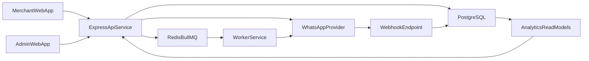

# Custva Architecture (Express.js MVP)

## System context

Custva is a multi-tenant SaaS platform where each merchant accesses isolated customer, campaign, and analytics data using `merchant_id` scoped authorization.

## Repository layout

- `apps/web-merchant`: merchant user interface (Next.js, React Query, Zustand)
- `apps/web-admin`: platform admin interface (Next.js)
- `apps/api`: HTTP API and business logic (Express.js, TypeScript)
- `apps/worker`: asynchronous background processing (BullMQ workers)
- `packages/shared`: shared contracts and validation schemas
- `packages/whatsapp-adapters`: provider interfaces and concrete adapters
- `infra`: deployment and infrastructure assets
- `docs`: technical standards and operating docs
- `scripts`: automation for local/dev/prod workflows

## API service architecture

`apps/api` follows a layered modular architecture:

1. **Route layer**: request mapping + auth guards + input validation
2. **Service layer**: business rules and orchestration
3. **Repository layer**: SQL/data access and transaction boundaries
4. **Integration layer**: Redis, WhatsApp providers, email/SMS, external services

Domain modules:

- `auth`
- `customers`
- `campaigns`
- `templates`
- `messages`
- `analytics`
- `admin`

Cross-cutting modules:

- `config` (typed environment loading/validation)
- `logger` (structured logs + correlation IDs)
- `errors` (standard API error envelope)
- `security` (rate limiting, password policy, token helpers)

## Runtime components

## Deployment targets

- Frontends: Vercel
- API + Worker: AWS ECS, Railway, or Render (containerized)
- Database: Supabase PostgreSQL or AWS RDS PostgreSQL
- Queue backend: Redis managed instance
- Observability: Sentry + Cloud provider logs/metrics

## Performance and reliability controls

- API p95 response objective: `< 300ms` on indexed read paths
- Dashboard load objective: `< 2s` using pre-aggregated metrics
- Queue retries: exponential backoff with dead-letter queue
- Health checks: `/health/live` and `/health/ready`
- Backups: automated nightly snapshot + restore drills
